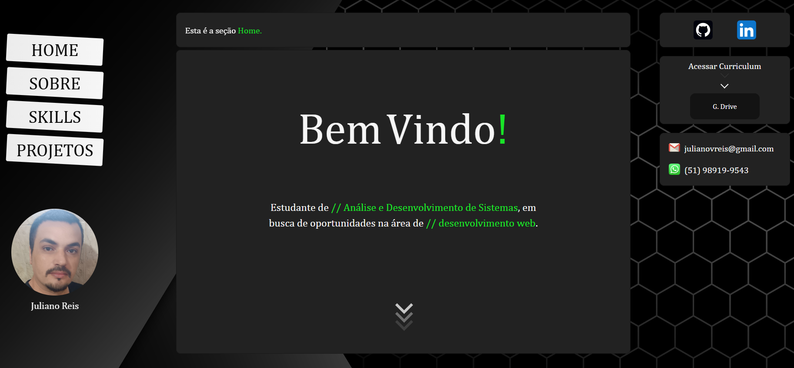

# Portfólio Profissional – Juliano Reis

Bem-vindo ao meu portfólio!  
Este projeto foi criado para apresentar meus projetos, trajetória acadêmica, habilidades técnicas e formas de contato, com um design moderno e responsivo, pensado para destacar minha jornada no desenvolvimento web.

---

## 📸 Demonstração



---

## ✨ Funcionalidades

- **Menu Fixo Lateral/Superior**: Navegação fácil entre Home, Sobre, Skills, Projetos e Contato.
- **Integração com GitHub & LinkedIn**: Ícones para acesso direto às minhas redes profissionais.
- **Currículo Online**: Botão para acessar meu currículo via Google Drive.
- **Contato Rápido**: E-mail e WhatsApp exibidos para contato imediato.
- **Animações e Efeitos Visuais**: Transições suaves (AOS.js) e animação de texto (TypeIt.js).
- **Seção Sobre**: Breve apresentação e objetivos profissionais.
- **Skills, Cursos e Certificados**: Flip cards interativos com links para certificados no GitHub.
- **Projetos em Destaque**: Cards com tecnologias utilizadas, imagem ilustrativa e link direto para o projeto.
- **Responsivo**: Layout adaptável para desktop e dispositivos móveis.

---

## 🛠️ Tecnologias Utilizadas

- **HTML5**
- **CSS3**
- **JavaScript**
- [AOS.js](https://michalsnik.github.io/aos/) (Animações on scroll)
- [TypeIt.js](https://typeitjs.com/) (Efeito de máquina de escrever)
- SVG e imagens vetoriais personalizadas

---

## 📁 Estrutura do Projeto

```
/
├── index.html             # Página principal
├── style.css              # Estilos customizados e responsivos
├── script.js              # Scripts para animações e interatividade
├── img/                   # Imagens, ícones, foto de perfil
├── font/                  # Fontes personalizadas
```

---

## 🚀 Como Executar

1. **Clone este repositório:**
   ```bash
   git clone https://github.com/JulianoVReis/portfolio.git
   ```
2. **Acesse a pasta do projeto:**
   ```bash
   cd portfolio
   ```
3. **Abra o arquivo `index.html` no seu navegador favorito.**
   - Para navegação dinâmica funcionar perfeitamente, recomenda-se rodar em um servidor local:
     ```bash
     # Python 3
     python -m http.server
     # ou Node.js
     npx http-server .
     ```

---

## 📚 Seções do Portfólio

- **Home:** Apresentação inicial e links para contato rápido.
- **Sobre:** História e objetivos profissionais.
- **Skills:** Lista de cursos, formações e certificados.
- **Projetos:** Galeria de projetos com imagens, tecnologias e links.
- **Contato:** E-mail, WhatsApp, GitHub e LinkedIn.

---

## 💡 Diferenciais

- **Visual moderno** com animações e efeitos.
- **Navegação acessível** em qualquer dispositivo.
- **Certificados auditáveis** com links diretos ao GitHub.
- **Projetos reais e atualizados** para consulta.

---

## 👨‍💻 Autor

Desenvolvido por **Juliano Reis**  
[LinkedIn](https://www.linkedin.com/in/juliano-reis-290b0b324/) | julianovreis@gmail.com

---

## 📄 Licença

Este portfólio é de uso pessoal, mas pode servir de inspiração para outros desenvolvedores.  
Para reutilização de partes específicas, por favor, entre em contato.
