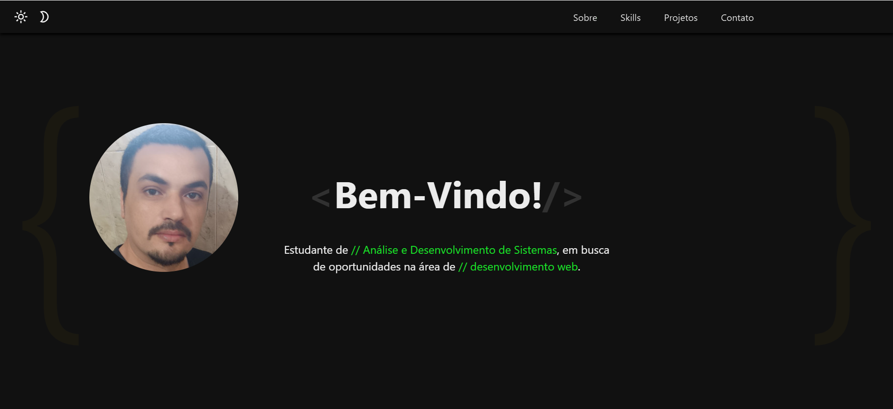

# Portfólio Interativo

Este é um projeto de portfólio pessoal desenvolvido com HTML, CSS e JavaScript. Ele exibe informações sobre o autor, habilidades técnicas, projetos e formas de contato, tudo em uma única interface interativa, moderna e responsiva.

## 🖼️ Preview



> Coloque um print da interface do site na pasta `/img` com o nome `preview.png`. Essa imagem aparecerá aqui como visualização do projeto no GitHub.

## ✨ Funcionalidades

- Interface com layout único (single box), sem múltiplas páginas.
- Cada seção (Sobre, Skills, Projetos, Contato) é exibida dinamicamente na mesma tela com efeito de transição de **baixo para cima**.
- Animações suaves com `opacity` e `transform: translateY(1.875rem)`.
- Efeito de digitação usando a biblioteca **TypeIt**.
- Alternância entre **modo claro** e **modo escuro** com ícones animados.
- Menu fixo no topo com destaque da seção ativa.
- Responsivo para **mobile**, **tablet** e **desktop**.
- Dropdown menu adaptado para telas menores.
- Cartões interativos nos projetos (hover, flip e efeitos visuais).

## 🧱 Tecnologias Utilizadas

- HTML5
- CSS3 (rem, keyframes, media queries)
- JavaScript Vanilla
- TypeIt.js (efeito de digitação)

## 🚀 Como Rodar Localmente

1. Clone o repositório:
   ```bash
   git clone https://github.com/JulianoVReis/portfolio
   ```

2. Acesse a pasta:
   ```bash
   cd seu-repositorio
   ```

3. Abra o arquivo `index.html` no navegador.

## 📁 Estrutura

```
├── index.html        # Estrutura da interface
├── style.css         # Estilos, temas e animações
├── script.js         # Comportamento dinâmico e interatividade
├── /img              # Ícones, fotos, logos, preview.png, etc.
```

## 💡 Observações

- A navegação entre seções acontece **sem recarregar a página**, via exibição condicional de `.divs`.
- Nenhum efeito de desfoque é aplicado ao conteúdo de fundo.
- O código é limpo, organizado e facilmente escalável.

## 📞 Contato

Entre em contato diretamente pela seção **Contato** do próprio site.

---

Desenvolvido com 💻 e ☕ por [Juliano Reis].